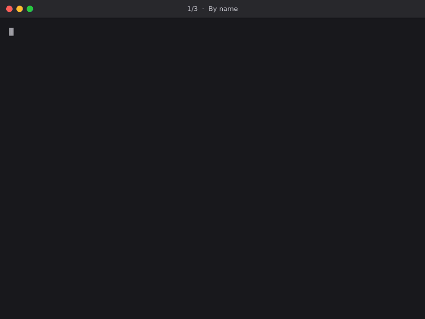

<div align="center">

# J-Jump

**Jump to any folder by name, by meaning or in any language, straight from your shell.**

[](https://github.com/mreasonyang/j-jump/releases/latest)
[](LICENSE.md)


**English** · [简体中文](README.zh-CN.md)

</div>

<p align="center"></p>

You never typed "resumes" or "taxes". J-Jump remembers the folders you visit, takes you to the right one by a few
letters of its name and, with the optional Jev semantic model, finds it by what it means, even in another language.

## Why J-Jump

- **By name, instantly.** `j pay` jumps to the best match among folders you've actually visited. Ranking happens on
  your machine and uses no network.
- **By meaning, with Jev.** Can't remember the folder's name? `ji my cv` asks Jev which folder you mean.
- **In any language.** `ji 税务` finds `taxes`; `ji machine learning experiments` finds `机器学习实验`.
- **You stay in control.** Jev is off until you turn it on. It only suggests: nothing moves until you pick. In the
  default strict mode, it receives only your query and folder names.
- **Small and native.** One Rust binary for Bash, Zsh and Fish on macOS and Linux. No runtime or plugin manager is
  needed, and no background service runs for local navigation.

## Quick start

### 1. Install

**Homebrew**:

```sh
brew install mreasonyang/taps/j-jump && jjump shell install
```

**Install script** (macOS 15+ or Linux; x86-64 or ARM64):

```sh
curl -fsSL https://raw.githubusercontent.com/mreasonyang/j-jump/main/install.sh | sh
```

The script picks the right build for your system, verifies its SHA-256 checksum and installs `jjump` (plus the
equivalent `j-jump`) into `~/.local/bin`. It connects Bash, Zsh or Fish and adds the binary directory to PATH, with
backups of existing startup files. It needs no sudo. Pass `--no-shell` to skip shell configuration.
[Script options](docs/RELEASE.md#download-installer).

### 2. Open a new terminal

The installation commands above connect your shell automatically. Open a new terminal to use `j` and `ji`.
For an existing installation, run `jjump shell install`; undo its managed configuration with `jjump shell uninstall`.
[Shell options, backups and manual setup](packaging/README.md).

> Already use `j` for something else? Run `jjump shell install --cmd jump` to create `jump` and `jumpi` instead.
> J-Jump refuses to overwrite existing `j`/`ji` commands.

### 3. Start jumping

Keep using `cd` as usual. J-Jump starts with an empty history and learns each folder you visit. The first time you run
`j` or `ji`, a short setup wizard opens; choose local-only if you don't want Jev yet, which needs no key. You can
change everything later with `jjump setup`.

## Everyday use

| Command | What it does |
| --- | --- |
| `j pay` | Jump to the best visited folder matching `pay` |
| `j api server` | Match several words in order along the path |
| `j api /` | Only search inside the current folder |
| `j` | Go to your home folder |
| `j -` | Go back to the previous folder |
| `j ../dir`, `j -- 'my folder'` | Plain paths work too |
| `ji` | Browse your history in a numbered list |
| `ji pay` | Choose from matches; asks the selected provider first when semantic help is enabled |
| `j pay ` then <kbd>Tab</kbd> | Choose a match into the command line, then press <kbd>Enter</kbd> to go |

**How matches are ranked:** exact folder name, then prefix, then substring, then a match on a parent folder. Within each
tier, folders you visit often and recently come first; visit weight halves every seven days. Run `jjump explain pay` to
see the ranking.

**In the picker:** type a number to jump, `n`/`p` to change page, `v 3` to see a full path, and Enter or `q` to cancel.
If you prefer fuzzy filtering, install [fzf](https://github.com/junegunn/fzf) and set `export J_JUMP_PICKER=fzf`.

## Jev and Clef-Flash: find folders by meaning

Jev and Cloudflare Clef-Flash are optional semantic model services. Semantic help is **off by default**, and local navigation never needs a provider.

**Turn it on** with `jjump setup`: choose Jev and paste your key. Input is hidden, and the key is saved to your OS
credential store, never to a file. Alternatively, set `TYPESAFE_API_KEY` in your environment and run
`jjump config set semantic on`. A key alone never enables requests.

In setup, `off` keeps navigation local. At the key step, `skip` stops using the stored key, while environment keys still apply.
To turn off cloud requests, choose `off` or run `jjump config set semantic off`.

**When the selected provider is asked:**

- `j pay` with a local match jumps immediately and never contacts the provider. Only when nothing matches locally may it ask the provider.
- `ji QUERY` and <kbd>Tab</kbd> completion with a query ask the selected provider when semantic help is enabled. A bare `ji`, `--offline` and
  `J_JUMP_OFFLINE=1` stay local.
- The suggestion is marked `[Jev]` or `[Clef-Flash]` at the top of the list, and you still choose. Cancelling never picks anything.
- With the default `consent ask`, J-Jump confirms before each request. `jjump config set consent always` skips that.
  The selected service may charge per request.
- A request waits up to 10 seconds. While waiting, press Enter to switch to local choices or `W` to keep waiting.
  Errors, timeouts and "not sure" answers stop without moving you.

### Choose Cloudflare Clef-Flash

Run `jjump setup`, select `clef-flash`, enter your Cloudflare Account ID and paste a Workers AI API token.
The token uses its own OS credential entry, separate from Jev. You can also use environment credentials:

```sh
export CLOUDFLARE_ACCOUNT_ID="your-32-character-account-id"
export CLOUDFLARE_AUTH_TOKEN="your-workers-ai-api-token"
jjump config set provider clef-flash
jjump config set semantic on
```

`CLOUDFLARE_API_TOKEN` is an alias, used when `CLOUDFLARE_AUTH_TOKEN` is absent or empty.
`CLOUDFLARE_ACCOUNT_ID` overrides the saved `cloudflare_account_id`; tokens override only their own provider's stored key.
An invalid nonempty Account ID environment value blocks requests. Correct it, or unset it to use the saved account.
Invalid environment keys/tokens also block cloud requests; `doctor` checks their format locally without sending or displaying them.
Switch back with `jjump config set provider jev`. Jev remains the default, and enabling either provider is a separate setting.
`jjump credential status/set/delete` operates on the selected provider. Switching discards an unsaved key draft;
previously saved provider credentials are kept. Requests use the [official Workers AI REST API](https://developers.cloudflare.com/workers-ai/models/clef-flash/),
with the `clef-flash` model. Privacy, consent, offline mode and explicit selection apply to both providers; suggestions
are labelled with the selected provider. Cached responses are bound to provider, account and credential. Failed requests
never switch providers automatically. `doctor` checks configuration locally; it does not verify API permissions or test cloud inference.

### What the selected provider can see

| `privacy` setting | Sent to the selected provider |
| --- | --- |
| `strict` (default) | Your query and candidate folder names |
| `balanced` | Plus each folder's parent name, the current folder's name and a low/medium/high visit level |
| `full` | Like `balanced`, but with full parent and current folder paths |

File contents, Git remotes, environment variables, shell history and credentials are **never** sent. Folder names and
queries can themselves be sensitive, so you have more controls:

- `jjump preview "my cv"` prints the exact request without sending anything.
- `no_send` folders still work locally but are never sent to a provider, and semantic requests are off while you're inside them.
- `exclude` folders are never recorded or searched at all.

```sh
jjump config set no_send '["/work/private-client"]'
jjump config set exclude '["/work/scratch"]'
```

## Configuration

Use the interactive `jjump setup`, or `jjump config set KEY VALUE`. `jjump config show` prints current values, and
`jjump doctor` runs offline checks with next steps.

| Key | Values | Default |
| --- | --- | --- |
| `semantic` | `on`, `off` | `off` |
| `provider` | `jev`, `clef-flash` | `jev` |
| `cloudflare_account_id` | 32 hexadecimal characters or empty | empty |
| `consent` | `ask`, `always` | `ask` |
| `privacy` | `strict`, `balanced`, `full` | `strict` |
| `tracking` | `on`, `off` | `on` |
| `exclude`, `no_send` | JSON array of absolute paths | `[]` |
| `language` | `auto`, `en`, `zh` | `auto` |
| `semantic_route` | `local_first`, `force` (always ask the selected provider; you still choose) | `local_first` |
| `candidate_limit` | `1`–`254` folder groups offered to the selected provider | `254` |

| Environment variable | Effect |
| --- | --- |
| `TYPESAFE_API_KEY` | Jev key; takes priority over the stored Jev key |
| `CLOUDFLARE_AUTH_TOKEN` | Workers AI token; takes priority over the stored Cloudflare token |
| `CLOUDFLARE_API_TOKEN` | Alias when `CLOUDFLARE_AUTH_TOKEN` is absent or empty |
| `CLOUDFLARE_ACCOUNT_ID` | Cloudflare account; overrides the saved Account ID |
| `J_JUMP_PICKER` | `fzf` or `numbered` (default) |
| `J_JUMP_OFFLINE=1` | Keep this command local |
| `J_JUMP_LANG` | `en` or `zh` messages |
| `J_JUMP_CONFIG` | Use another config file (`--config` takes priority) |
| `J_JUMP_HOME` | Keep config, history and cache under another absolute folder (the OS credential entry is still shared) |

Files live in `~/Library/Application Support/j-jump` and `~/Library/Caches/j-jump` on macOS, and in the XDG folders
`~/.config/j-jump`, `~/.local/share/j-jump` and `~/.cache/j-jump` on Linux.

## Your history and data

```sh
jjump history list
jjump history forget --preview -- /work/old-project
jjump history prune                 # preview visits to folders that no longer exist
jjump config set tracking off       # pause recording
mkdir -m 700 ~/jjump-backup && jjump history backup ~/jjump-backup/visits.json
jjump history restore ~/jjump-backup/visits.json    # validates; add --apply to replace
jjump history clear --preview
jjump data clear --preview          # history and cached semantic answers
jjump credential delete             # remove the selected provider key (preview)
```

Anything that deletes or replaces data shows a preview first; add `--apply` to do it. Backups must sit in a private
(`chmod 700`) folder. Deleting is not secure erasure.

## Troubleshooting

| Problem | Fix |
| --- | --- |
| `j foo` finds nothing | J-Jump only knows folders visited since you installed it. `cd` there once, or check with `jjump explain foo`. |
| `j` or `ji` is already taken | Initialize with `--cmd jump` to get `jump` and `jumpi`. |
| <kbd>Tab</kbd> doesn't insert a choice in Bash | Your terminal didn't answer Bash's cursor query; the line is left as it was. Use `ji foo` instead. |
| Linux can't save the key | The OS credential store needs a Secret Service session, such as GNOME Keyring. Or use `TYPESAFE_API_KEY`. |
| An error mentions an old or unknown format | J-Jump is pre-1.0 and reads only its current state formats. Your files are left untouched; `jjump doctor` shows the remedy. |
| Anything else | Run `jjump doctor`. It's offline and suggests next steps. |

Exit codes for scripts: `2` input, `3` no match, `4` selection required, `5` provider, `6` path, `7` state, `130` cancelled.

## Update and uninstall

| | Homebrew | Install script |
| --- | --- | --- |
| Update | `brew upgrade mreasonyang/taps/j-jump` | Re-run the installer with `--replace` (below) |
| Uninstall | `brew uninstall mreasonyang/taps/j-jump` | Run `install.sh --uninstall` from a [release archive](packaging/README.md#replace-recover-and-remove) |

```sh
curl -fsSL https://raw.githubusercontent.com/mreasonyang/j-jump/main/install.sh | sh -s -- --replace
```

Uninstalling keeps your settings, history and stored key; clear them first with the commands above if you want them gone.
Run `jjump shell uninstall` before removing the binary to undo managed shell configuration. Remove any manual `jjump init` lines yourself.

## Platforms

| System | Install script | Homebrew |
| --- | --- | --- |
| macOS 15+ on Apple silicon | ✅ | Available |
| macOS 15+ on Intel | ✅ | Available |
| Linux x86-64 (static musl build) | ✅ | Available |
| Linux ARM64 (static musl build) | ✅ | Available |

✅ means the installed 0.0.38 archive passes native tests on that system. "Available" means the Formula supports that
Homebrew route and its downloads are verified; the complete Homebrew lifecycle has not been tested natively for this release.
Historical Apple silicon Homebrew acceptance applies to 0.0.35 only. Binaries are unsigned (no macOS notarization);
installers check SHA-256 checksums instead. Windows, 32-bit systems and macOS before 15 aren't supported.
Details: [release status and platform limits](docs/RELEASE.md).

<details>
<summary><b>Build from source</b></summary>

You need Rust 1.88+ (for example via [rustup](https://rustup.rs)), a C toolchain and Python 3. SQLite and TLS are built
in.

```sh
git clone https://github.com/mreasonyang/j-jump.git && cd j-jump
cargo build --locked --release
python3 scripts/package.py --binary target/release/jjump --target "$(rustc -vV | sed -n 's/^host: //p')" --dist dist
cd dist && sha256sum -c j-jump-*.tar.gz.sha256     # macOS: shasum -a 256 -c ...
tar -xzf j-jump-*.tar.gz && cd j-jump-*/
./install.sh --prefix "$HOME/.local"
```

See [archive installation](packaging/README.md) for replacing and removing an installation.

</details>

## Documentation

- [Configuration, privacy and recovery guide](docs/CONFIGURATION-AND-HELP.md) (in Chinese)
- [Install script, releases and platform limits](docs/RELEASE.md)
- [Archive installation, replacement and removal](packaging/README.md)
- [Documentation index](docs/README.md)

## Contributing

Bug reports and ideas are welcome in [GitHub Issues](https://github.com/mreasonyang/j-jump/issues). Before changing
code, read the [development instructions](AGENTS.md) and run `./scripts/test-product.sh`.

## License

[MIT](LICENSE.md). Release archives include the licenses and notices of all dependencies.
